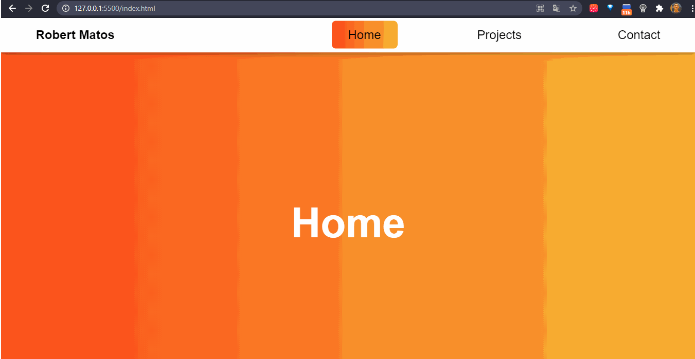
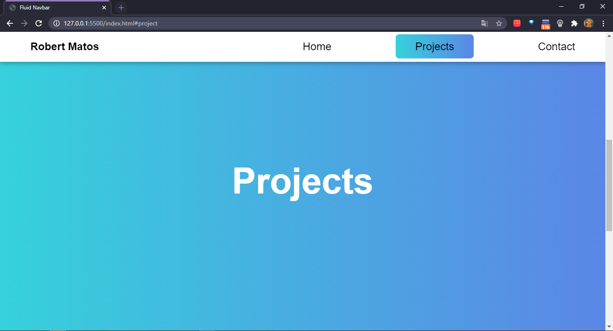
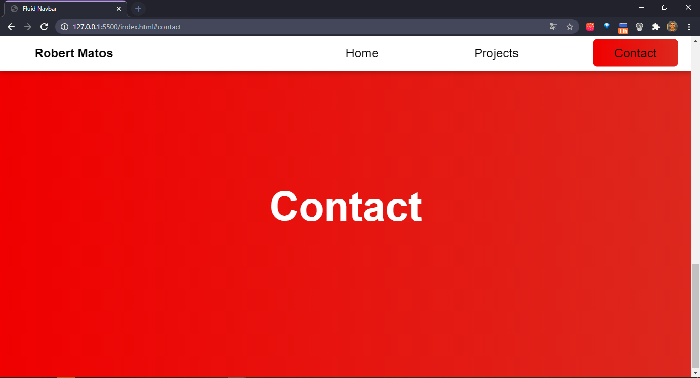

<h1 align="center">Fluid Navbar</h1>

💻 A Javascript web application of an animated navbar

    <a href="#-projeto-final">Final Project</a> |
    <a href="#-tecnologies">Tecnologies</a> |
    <a href="#-project">Project</a> |
    <a href="#-layout">Layout</a> |
    <a href="#memo-licence">Licence</a> |
    <a href="#-credits">Credits</a>

## Final Project

> Netlify: https://fluidnavbar-robert.netlify.app/

    

## 🚀 Tecnologies

This project was developed with the following technologies:

- HTML
- CSS
- JavaScript

## 💻 Project

Fluid navbar is a web application made with javascript in which the navbar changes as you scroll the screen.

## 🔖 Layout

## :memo: Licence

This project is under the MIT license. See the file [LICENSE](LICENSE.md) for more details.

## 🏆 Credits

Made by Robert Matos
